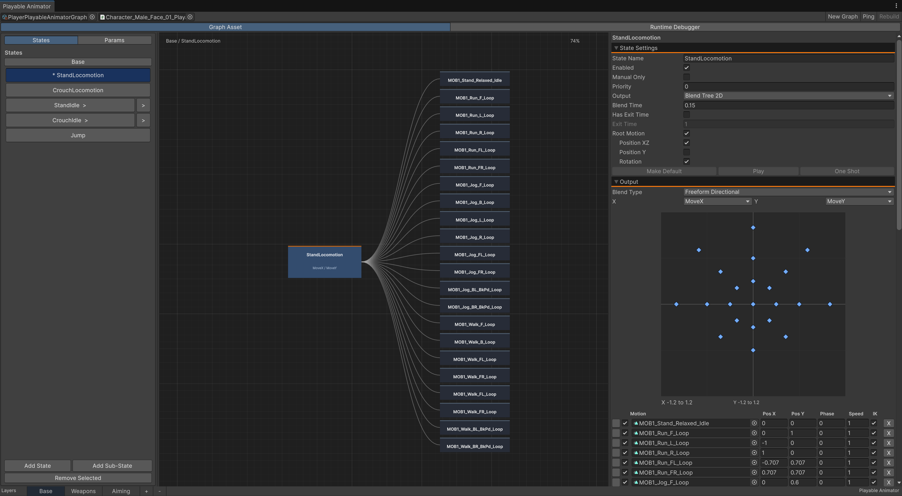
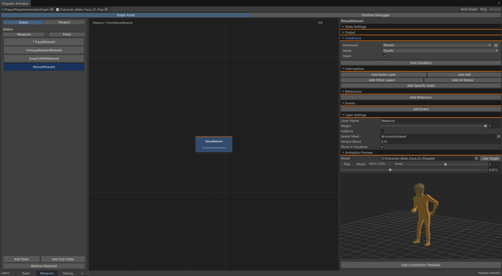
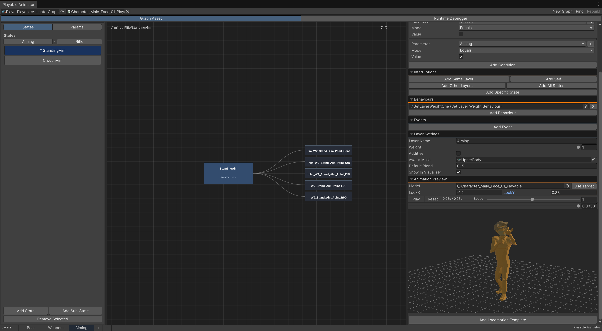

# PlayGraph

PlayGraph is a graph-based character animation and interaction framework built
on Unity Playables. It provides animator-style state authoring, layers, blend
trees, root motion, runtime debugging, contextual object animations, and APIs
for controlling animation without requiring an Animator Controller.

[View PlayGraph on GitHub](https://github.com/therealloft/playgraph)

## Features

- Clip, playlist, one-shot, 1D blend tree, 2D blend tree, and direct blend
  state outputs
- Float, bool, integer, trigger, and enum parameters
- Conditional state selection with priority and optional exit time
- Nested sub-state machines
- Override and additive layers with Avatar Masks and runtime layer weights
- Per-state root motion with independent XZ, Y, and rotation channels
- State behaviours, timed Unity Events, and configurable interruption scopes
- Scroll-wheel graph zoom and middle-mouse panning
- In-editor animation and blend-tree preview
- Runtime graph mounting for equipment and contextual animation sets
- Object-owned enter, loop, exit, and action animations
- Optional integration with Unity's PlayableGraph Visualizer

## Screenshots

### Blend Tree Authoring



Author a full 2D locomotion blend tree while viewing its motion graph, blend
space, state settings, root-motion channels, and layer tabs in one window.

### State Configuration And Preview



Configure conditions, interruption scope, behaviours, events, Avatar Masks,
and inspect the selected animation using the integrated model preview.

### Layered Aiming



Build masked upper-body animation layers and preview parameter-driven aiming
motions without leaving the graph editor.

## Requirements

- Unity 6 (`6000.0`) or newer
- No required package dependencies

The runtime and editor code are in separate assemblies. Player builds do not
reference `UnityEditor` or require the PlayableGraph Visualizer package.

## Installation

In Unity, open **Window > Package Management > Package Manager**, select the
`+` menu, and choose **Install package from git URL**.

Enter:

```text
https://github.com/therealloft/playgraph.git
```

You can pin a tag or commit by appending `#<tag-or-commit>` to the URL.

## Quick Start

1. Create a graph with **Assets > Create > Play Graph > Playable Animator Graph**.
2. Add an `Animator` and `PlayableAnimator` to the character.
3. Assign the Animator and graph asset on the `PlayableAnimator` component.
4. Open **Play Graph > Playable Animator**.
5. Select the graph and, for live debugging or preview, select the character.
6. Add parameters, layers, and states in the editor window.
7. Mark one state in each layer as the default state.

The component initializes automatically in play mode when **Play On Enable** is
enabled. **Clear Animator Controller** lets PlayGraph own the Animator output
without the original controller also evaluating.

## Driving Parameters

All runtime types use the `Playgraph` namespace.

```csharp
using Playgraph;
using UnityEngine;

public sealed class CharacterAnimationDriver : MonoBehaviour
{
    [SerializeField] private PlayableAnimator playableAnimator;

    public void SetMovement(Vector2 movement, bool grounded)
    {
        playableAnimator.SetFloat("MoveX", movement.x);
        playableAnimator.SetFloat("MoveY", movement.y);
        playableAnimator.SetBool("Grounded", grounded);
    }

    public void SetWeapon(string weapon)
    {
        playableAnimator.SetEnum("Weapon", weapon);
    }

    public void Reload()
    {
        playableAnimator.SetTrigger("Reload");
    }
}
```

The complete parameter API is:

```csharp
animator.SetFloat("Speed", 1f);
animator.SetBool("Grounded", true);
animator.SetInteger("Combo", 2);
animator.SetEnum("Weapon", "Pistol");
animator.SetTrigger("Fire");
animator.ResetTrigger("Fire");
```

Matching `GetFloat`, `GetBool`, `GetInteger`, `GetEnum`, and `GetTrigger`
methods are also available.

## States And Transitions

A state can use one of the following outputs:

| Output | Purpose |
| --- | --- |
| Clip | Plays one animation clip. |
| Playlist | Plays enabled motion clips in sequence. |
| Blend Tree 1D | Blends motions along one parameter and threshold axis. |
| Blend Tree 2D | Blends motions using Freeform Directional or Freeform Cartesian weights. |
| Direct Blend | Drives each motion with its assigned parameter. |
| One Shot | Plays a non-looping state and returns to the normal state selection. |

Conditions are evaluated against graph parameters. When multiple states are
eligible, the state with the highest priority wins. Use **Manual Only** for
states that should only be entered through code.

```csharp
playableAnimator.PlayState("Crouch", "Base");
playableAnimator.ClearManualState("Base");
playableAnimator.TriggerOneShot("Reload", "Upper Body");
```

Exit time delays a transition until the configured normalized state time.
Interruptions can target self, the same layer, other layers, all layers, or a
specific state, and can occur immediately or after exit time.

Sub-state machines group related states and may contain their own default and
exit states.

## Layers

Layers support an Avatar Mask, additive evaluation, a default weight, and live
weight control:

```csharp
playableAnimator.SetLayerWeight("Upper Body", 1f);
float weight = playableAnimator.GetLayerWeight("Upper Body");
```

This is useful for equipment, aim offsets, injuries, facial animation, and
other animation sets that should affect only part of the rig.

## Root Motion

Enable root motion per state, then choose which channels it contributes:

- **Position XZ** for horizontal travel
- **Position Y** for vertical travel
- **Rotation** for authored turning

When `ApplyRootMotionToTransform` is `true`, `PlayableAnimator` applies the
selected channels directly to the character transform. When it is `false`, the
component still emits `RootMotionEvaluated`, allowing a character motor or
custom movement system to consume the deltas.

```csharp
using Playgraph;
using UnityEngine;

public sealed class RootMotionBridge : MonoBehaviour
{
    [SerializeField] private PlayableAnimator playableAnimator;
    [SerializeField] private CustomCharacterController controller;

    private void OnEnable()
    {
        playableAnimator.ApplyRootMotionToTransform = false;
        playableAnimator.RootMotionEvaluated += OnRootMotion;
    }

    private void OnDisable()
    {
        playableAnimator.RootMotionEvaluated -= OnRootMotion;
    }

    private void OnRootMotion(Vector3 position, Quaternion rotation)
    {
        controller.AccumulateRootMotion(
            position,
            rotation,
            AnimationRootMotionMode.OverrideHorizontal);
    }
}
```

The supplied `CustomCharacterController` also needs its normal simulation loop
to call `BeginSimulationStep`, provide movement commands, and call `Simulate`.
Use `AnimationRootMotionMode.Additive` to add authored displacement to motor
movement, or `OverrideHorizontal` to replace horizontal motor movement.

## State Behaviours And Events

Create reusable behaviour assets by deriving from `PlayableStateBehaviour`:

```csharp
using Playgraph;
using UnityEngine;

[CreateAssetMenu(menuName = "Play Graph/Behaviours/Random Integer")]
public sealed class RandomIntegerStateBehaviour : PlayableStateBehaviour
{
    public override void OnPlayableStateEnter(
        PlayableAnimator animator,
        string layerName,
        string stateName)
    {
        animator.SetInteger("RandomValue", Random.Range(0, 10));
    }
}
```

Available callbacks are:

- `OnPlayableStateEnter`
- `OnPlayableStateUpdate`
- `OnPlayableStateExit`
- `OnPlayableStateEvent`

Create the behaviour asset and assign it in a state's **Behaviours** section.
These are PlayGraph callbacks and do not use Unity `StateMachineBehaviour`
method signatures.

State events may use normalized time or seconds, fire once or every loop, call
a Unity Event, and notify assigned state behaviours.

## Object-Owned Animations

Objects such as doors, levers, pickups, chests, and weapons can provide their
own character animations without the character knowing about them in advance.

### Character Setup

Add `ObjectAnimationPlayer` next to the character's `PlayableAnimator`.

### Object Setup

1. Add `ObjectAnimationProvider` to the interactive object.
2. Optionally assign a character graph with enter, loop, and exit states.
3. Add named actions sourced from either a graph state or an animation clip.
4. For automatic activation, add a trigger Collider and
   `ObjectAnimationTrigger` to the object.
5. For manual activation, call the trigger or player API from interaction code.

The trigger resolves `ObjectAnimationPlayer` only when a collider enters or
when `Play` is called. The provider does not keep a player reference.

```csharp
if (animationTrigger.Play(playerGameObject))
{
    // The provider session began and its configured action played.
}
```

For longer interactions, control the session directly:

```csharp
player.Begin(provider);
player.PlayAction("Equip");
player.PlayAction("Fire");
player.PlayAction("Reload");
player.End();
```

Graph actions can be one shots or persistent states. Clip actions expose fade,
speed, Avatar Mask, additive, foot IK, layer weight, and root-motion settings.
The provider can also fire triggers on an Animator attached to the object.

## Runtime Graph Mounting

Additional graphs can be mounted over the base graph for equipment or temporary
animation sets:

```csharp
int handle = playableAnimator.MountGraph(weaponGraph, 0.15f);
playableAnimator.TriggerMountedOneShot(handle, "Reload", "Upper Body");
playableAnimator.SetMountedReturnState(handle, "Aim", "Upper Body");
playableAnimator.UnmountGraph(handle, 0.15f);
```

Use the returned handle to address the mounted graph. `MountClip` provides the
same mechanism for a configured external one-shot clip.

## PlayableGraph Visualizer

Visualization is optional. If an editor assembly containing
`GraphVisualizerClient.Show(PlayableGraph)` and `Hide(PlayableGraph)` is loaded,
the package's editor bridge forwards visualization requests to it. Without that
package, PlayGraph continues normally and player builds remain unaffected.

Enable visualization on both the `PlayableAnimator` component and graph asset.

## Package Layout

```text
uk.co.realloft.playgraph/
|-- Runtime/    Runtime components, graph data, and Playables evaluation
|-- Editor/     Graph authoring window, inspectors, previews, and visualizer bridge
|-- package.json
`-- README.md
```

## License

MIT
